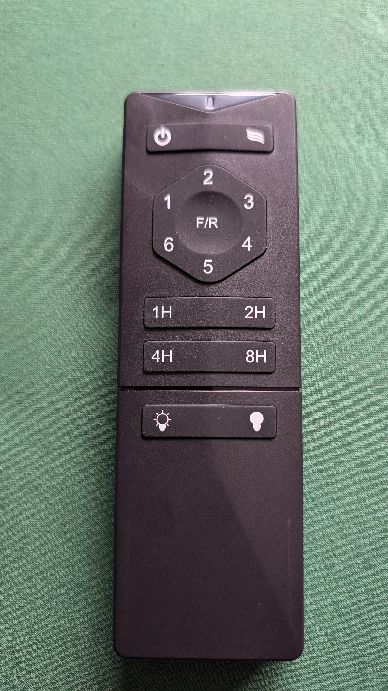
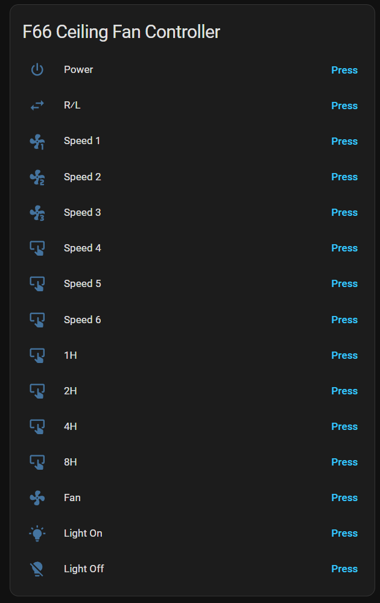

# F66 Ceiling Fan Controller for ESPHome

An ESPHome-based replacement for the **F66 433 MHz ceiling-fan remote** (FCC ID **2A6TK-F66**), used on the **VonLuce 52-Inch Ceiling Fan** ([Amazon UK B0D6VMZ47L](https://www.amazon.co.uk/dp/B0D6VMZ47L)), powered by an **ESP32-S3 DevKitC-1** and **CC1101** radio module.

The production firmware reproduces the original handset by transmitting **literal, hardware-verified RF captures**. All 15 remote functions have been tested successfully against the original fan receiver.


> **Release status:** Version 4.0.0 is confirmed working on the original test installation.

## Supported controls

| Physical Remote Handset | Home Assistant Controls |
| :---: | :---: |
|  |  |

The Home Assistant device exposes the controls in the same order as the physical remote:

1. Power
2. Fan
3. Speed 1
4. Speed 2
5. Speed 3
6. Speed 4
7. Speed 5
8. Speed 6
9. R/L
10. 1H
11. 2H
12. 4H
13. 8H
14. Light On
15. Light Off

It also exposes controller status and four RF tuning controls: frequency, CC1101 symbol rate, repeat count, and TX settling time.

## Flipper Zero Sub-GHz captures

Raw SubGHz pulse files captured using a Flipper Zero are provided in [`subghz/`](subghz):

- **`subghz/ALL BUTTONS SEQUENTIALLY.sub`**: Master RAW capture of all 15 remote buttons.
- **`subghz/SPEED 1 BUTTON.sub`**: RAW capture of the Speed 1 button.
- **`subghz/SEQUENCE README.txt`**: Sequence press index.

To replay directly from a Flipper Zero, copy the `.sub` files to `/sdcard/subghz/` on your Flipper.

## Hardware

- ESP32-S3 DevKitC-1 N16R8
- CC1101 433 MHz radio module
- F66 fan/receiver compatible with FCC ID 2A6TK-F66
- 3.3 V power and suitable wiring


### Wiring

| ESP32-S3 | CC1101 | Purpose |
|---|---|---|
| 3V3 | VCC | Power |
| GND | GND | Ground |
| GPIO12 | SCK | SPI clock |
| GPIO11 | MOSI | SPI data to CC1101 |
| GPIO13 | MISO | SPI data from CC1101 |
| GPIO10 | CSN/CS | Chip select |
| GPIO14 | GDO0 | RF transmit path |
| GPIO9 | GDO2 | RF receive path |

GPIO4 and GPIO5 are reserved for a possible future BME680 over I²C:

| ESP32-S3 | Future use |
|---|---|
| GPIO4 | SDA |
| GPIO5 | SCL |

The BME680 is **not enabled** in the 4.0.0 firmware.

## Installation

1. Install ESPHome and create a device using an ESP32-S3 DevKitC-1.
2. Copy [`firmware/F66-production-v4.yaml`](firmware/F66-production-v4.yaml) into your ESPHome configuration directory.
3. Ensure `secrets.yaml` contains:

   ```yaml
   wifi_ssid: "YOUR_WIFI_NAME"
   wifi_password: "YOUR_WIFI_PASSWORD"
   ```

4. Connect the CC1101 exactly as shown above.
5. Validate and install the firmware through ESPHome.
6. Add the discovered ESPHome device to Home Assistant.
7. Test every control with only the intended fan powered while commissioning.

## Verified RF profile

| Setting | Production value |
|---|---:|
| Frequency | 433.920 MHz |
| Modulation | ASK/OOK |
| Symbol rate | 2400 baud |
| CC1101 output power | +10 dBm |
| Filter bandwidth | 200 kHz |
| Frame repeats | 4 |
| TX settling | 1000 µs |

The firmware includes alternative runtime values for diagnosis, but the values above are the verified profile.

## Why literal replay?

Early work correctly recovered the apparent command data, but regenerated frames did not operate the fan reliably. A literal replay of the measured waveform worked immediately. Further comparison showed that the final framing bit was not a simple inverse of the last command bit.

The production implementation therefore treats the measured waveforms as immutable firmware data. They should not be normalised, regenerated, or “cleaned up” without testing new captures against real hardware.

See [Reverse Engineering](docs/Reverse_Engineering.md) and [Protocol Analysis](docs/Protocol_Analysis.md).

## Multiple fans

Additional F66 fans have been ordered, but their addressing mechanism has not yet been measured. Different installations may use an address field, factory-programmed command sets, an undocumented learning process, or another mechanism.

Do not assume that this capture set will control every F66 receiver. Commission each installation carefully and capture at least one command from each new handset before combining multiple fans into one controller.

See [Multiple Fan Support](docs/Multiple_Fans.md).

## Repository contents

```text
firmware/                 Confirmed production ESPHome firmware
docs/                     Hardware, protocol and investigation notes
images/                   Photographic documentation and diagrams
subghz/                   Flipper Zero raw .sub capture files & index
captures/                 Placeholder for future signal analysis dumps
.github/                   Issue templates
ANTIGRAVITY_HANDOFF.md    Ordered publishing instructions
CHANGELOG.md               Version history
LICENSE                    MIT licence
```

## Safety and radio notes

- Power the CC1101 from **3.3 V**, not 5 V.
- Check the pin labels on your particular CC1101 board; clone layouts vary.
- Keep mains wiring and the low-voltage controller physically separated.
- Confirm local radio regulations before changing frequency, power, or antenna configuration.
- This project emulates an existing household remote; it does not provide feedback about the fan’s actual state.

## Firmware integrity

Confirmed V4 SHA-256:

```text
ef5f8cb16de8fbe65880108bb56e23ac9aa63a31ef7f5afe36b04988c73dcab0
```

## Licence

MIT. See [LICENSE](LICENSE).

## Project status

- [x] Original remote captured
- [x] CC1101 configuration established
- [x] All 15 controls verified
- [x] Production V4 tested successfully
- [x] Flipper Zero `.sub` captures documented
- [x] Photographic documentation added
- [ ] Determine addressing behaviour across additional fans
- [ ] Add optional BME680 support

